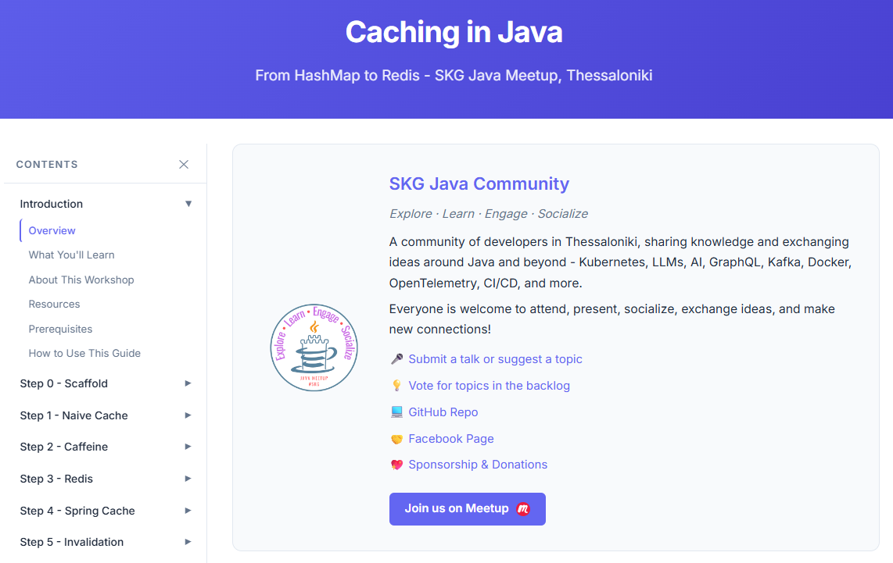

# Caching in Java: From HashMap to Redis -- SKG Java Meetup Demo

A progressive, hands-on demo built for the [SKG Java Meetup](https://www.meetup.com/thessaloniki-not-only-java/) (Thessaloniki) showing how caching works in Java applications: local caches, distributed caches, the Spring Cache abstraction, and the problems nobody tells you about.

One deliberately slow endpoint (`GET /products/{id}`, one second per call) is made fast in 14 small steps -- a plain `HashMap`, a `ConcurrentHashMap`, Caffeine, Redis, and finally Spring's `@Cacheable` with three different providers -- and then broken again by an update, to show why cache invalidation is the hard part.

<div align="center">

[](https://lefterisxris.github.io/java-caching-meetup-demo/workshop-guide.html)

<a href="https://lefterisxris.github.io/java-caching-meetup-demo/workshop-guide.html">
  
</a>

</div>

> [!TIP]
> **New here? Start with the Workshop Guide!**
> A complete, step-by-step walkthrough (with screenshots) for building this project from scratch:
> **https://lefterisxris.github.io/java-caching-meetup-demo/workshop-guide.html**

## Tech Stack

| Component         | Version                          |
|-------------------|----------------------------------|
| Java              | 21                               |
| Spring Boot       | 4.1.1                            |
| Caffeine          | managed by Boot                  |
| Spring Data Redis | 4.1.1 (Lettuce, Jackson 3)       |
| Redis             | 7 (Docker, `compose.yaml`)       |
| Maven             | 3.9+                             |

## Prerequisites

- **Java 21+** and **Maven** (or an IDE with a bundled Maven)
- **Docker** with `docker compose` -- needed for Redis (stages 6 and later)
- **curl** or the IntelliJ HTTP client

## Setup & Run

1. **Clone the repository**

   ```bash
   git clone https://github.com/LefterisXris/java-caching-meetup-demo.git
   cd java-caching-meetup-demo
   ```

2. **Start Redis** (plus two Redis UIs)

   ```bash
   docker compose up -d
   docker compose exec redis redis-cli ping     # PONG
   ```

   - Redis Commander: http://localhost:8081
   - Redis Insight: http://localhost:5540 (connection URL `redis://default@redis:6379`)

3. **Run the application**

   ```bash
   mvn spring-boot:run
   ```

   Or run the `App` class from your IDE. The startup log tells you which cache provider is active:

   ```
   CacheManager: RedisCacheManager
   Native cache: org.springframework.data.redis.cache.DefaultRedisCacheWriter
   ```

4. **Verify** -- request the same product twice and compare the timings

   ```bash
   curl -w '\n%{time_total}s\n' localhost:8080/products/1     # ~1 s   (miss)
   curl -w '\n%{time_total}s\n' localhost:8080/products/1     # ~0 s   (hit)
   ```

## The Stages

The repository has **one commit per stage**, each tagged. `git checkout <tag>`, restart the application, and observe.

| Stage | Tag                            | What changes                                                        | What you observe                                          |
|------:|--------------------------------|---------------------------------------------------------------------|-----------------------------------------------------------|
| 0     | `stage-00-no-cache`            | Slow repository, no cache                                           | Every request ~1 s                                        |
| 1     | `stage-01-hashmap`             | `HashMap` in the service                                            | 1 s, then 0 ms -- but unbounded and not thread-safe       |
| 2     | `stage-02-concurrenthashmap`   | `ConcurrentHashMap.computeIfAbsent`                                 | Thread-safe, one line, still never forgets                |
| 3     | `stage-03-caffeine`            | Caffeine `maximumSize(10)`, `expireAfterWrite(1m)`                  | A `Map` with policies                                     |
| 4     | `stage-04-caffeine-stats`      | `evictionListener`, `recordStats`, `/products/cache/stats`          | Hit/miss counts, `Evicting product: …`                    |
| 5     | `stage-05-loadingcache`        | `LoadingCache`, `refreshAfterWrite(10s)`                            | `cache.get(id)`, background reload                        |
| 6     | `stage-06-redis`               | `RedisTemplate<String, Product>`, JSON values, TTL 10 m             | `GET product:1` in `redis-cli`, survives app restart      |
| 7     | `stage-07-redis-ui`            | Redis Commander + Redis Insight in `compose.yaml`                   | Keys, values and TTLs in a browser                        |
| 8     | `stage-08-cacheable-simple`    | `@EnableCaching`, `@Cacheable("products")`, `spring.cache.type: simple` | `CacheManager: ConcurrentMapCacheManager`             |
| 9     | `stage-09-cacheable-caffeine`  | YAML only: `spring.cache.type: caffeine`                            | `CacheManager: CaffeineCacheManager`                      |
| 10    | `stage-10-cacheable-redis`     | YAML + `RedisCacheConfiguration` bean (JSON, TTL from properties)   | `CacheManager: RedisCacheManager`, key `products::1`      |
| 11    | `stage-11-update-stale`        | `PUT /products/{id}?newPrice=` without cache annotations            | GET → PUT → GET returns the **old** price (stale)         |
| 12    | `stage-12-cacheevict`          | `@CacheEvict` on `update`                                           | Next GET correct after ~1 s (miss + reload)               |
| 13    | `stage-13-cacheput`            | `@CachePut(key = "#result.id")` on `update`                         | Next GET correct in ~0 ms (hit)                           |

## API Endpoints

| Endpoint                            | Description                                          |
|-------------------------------------|------------------------------------------------------|
| `GET /products/{id}`                | Get a product (ids 1-10 from stage 6 onwards)        |
| `PUT /products/{id}?newPrice=`      | Update the price (stages 11+)                        |
| `GET /products/cache`               | Cache contents / keys (stages 4-7 only)              |
| `GET /products/cache/stats`         | Caffeine statistics (stages 4-5 only)                |

## Useful Redis Commands

```bash
docker compose exec -it redis redis-cli
```

```
KEYS products::*      # Spring Cache keys (manual stage: KEYS product:*)
GET products::1       # JSON value
TTL products::1       # seconds left
MONITOR               # live stream of commands
FLUSHALL              # clean start
```

## Workshop Guide

A comprehensive step-by-step guide for reproducing this workshop is hosted on GitHub Pages:

**[https://lefterisxris.github.io/java-caching-meetup-demo/workshop-guide.html](https://lefterisxris.github.io/java-caching-meetup-demo/workshop-guide.html)**

The source lives in the [`docs/`](docs/) directory. `workshop-guide.md` is the source of truth (it renders on GitHub as well); `workshop-guide.html` is generated from it with `python docs/generator/build_guide.py` (needs `pip install markdown pygments`).

## Resources

- [Spring Framework -- Cache Abstraction](https://docs.spring.io/spring-framework/reference/integration/cache.html)
- [Spring Boot -- Caching](https://docs.spring.io/spring-boot/reference/io/caching.html)
- [Caffeine](https://github.com/ben-manes/caffeine)
- [Spring Data Redis](https://docs.spring.io/spring-data/redis/reference/)
- [Redis commands](https://redis.io/docs/latest/commands/)
