# Caching in Java: From HashMap to Redis

**SKG Java Meetup -- Thessaloniki**

---

## Introduction

Caching sounds simple: store something expensive once and reuse it. In practice, things get interesting very quickly. Where should the cache live? How long should data stay cached? What happens when the application runs on multiple instances? When is an in-memory cache such as Caffeine the right choice, and when does a distributed cache like Redis make more sense? And what exactly happens behind Spring's `@Cacheable` annotation?

In this hands-on workshop we start from a Spring Boot application with one deliberately slow endpoint and we make it fast, step by step: a plain `HashMap`, a `ConcurrentHashMap`, Caffeine, Redis, and finally the Spring Cache abstraction. At every step we look at **what changes and what does not** in the application code, and at the problems each solution introduces.

The narrative of the whole workshop is:

```text
Problem → naive cache → local cache → distributed cache
        → Spring abstraction → invalidation
        → failure modes → decision framework
```

### What You'll Learn

- Why a plain `Map` is not a cache, and what a cache library adds on top of it
- **Caffeine**: size and time based eviction, statistics, `LoadingCache`, `refreshAfterWrite`
- **Redis** as a shared cache: serialization, TTL, `redis-cli`, Redis UIs
- **Spring Cache**: what `@Cacheable` does, what a `CacheManager` is, and how to switch providers in YAML
- **Invalidation**: the stale-data bug, `@CacheEvict`, `@CachePut`, the self-invocation trap
- The **failure modes** nobody tells you about (stale data, stampedes, unbounded caches, local inconsistency) and a decision framework for "should we cache this, and where?"

### About This Workshop

This workshop was presented at the **SKG Java Meetup** on **Wednesday, September 16, 2026** at Ok!Thess, Thessaloniki, as the opening session of the 2026-2027 season.


[View event details on Meetup →](https://www.meetup.com/thessaloniki-not-only-java/events/316466603/)

### Resources

- **Spring Framework -- Cache Abstraction**: [docs.spring.io/spring-framework/reference/integration/cache.html](https://docs.spring.io/spring-framework/reference/integration/cache.html) -- the reference for `@Cacheable`, `@CachePut`, `@CacheEvict` and `CacheManager`.
- **Spring Boot -- Caching**: [docs.spring.io/spring-boot/reference/io/caching.html](https://docs.spring.io/spring-boot/reference/io/caching.html) -- provider auto-configuration and the `spring.cache.*` properties.
- **Caffeine**: [github.com/ben-manes/caffeine](https://github.com/ben-manes/caffeine) -- the wiki is excellent, especially the pages on eviction, refresh and statistics.
- **Spring Data Redis**: [docs.spring.io/spring-data/redis/reference/](https://docs.spring.io/spring-data/redis/reference/) -- `RedisTemplate`, serializers and `RedisCacheManager`.
- **Baeldung**: [Spring Cache Guide](https://www.baeldung.com/spring-cache-tutorial), [Caffeine](https://www.baeldung.com/java-caching-caffeine), [Spring Boot Redis Cache](https://www.baeldung.com/spring-boot-redis-cache).

> [!NOTE]
> **Source Code.** The complete source code for this workshop is available on GitHub: [LefterisXris/java-caching-meetup-demo](https://github.com/LefterisXris/java-caching-meetup-demo). Every step of this guide is a Git tag (`stage-00-no-cache` … `stage-13-cacheput`), so you can either write the code yourself and compare, or simply `git checkout` the tag and run it.

### Prerequisites

- **Java 21+** and **Maven 3.9+** (or an IDE with a bundled Maven, such as IntelliJ IDEA)
- **Docker** (Docker Desktop or any Docker engine with `docker compose`) -- needed from Step 3 onwards, for Redis
- **curl** (Git Bash on Windows works fine), or the IntelliJ HTTP client -- the screenshots use the latter
- An IDE -- IntelliJ IDEA is used in the screenshots

### How to Use This Guide

Every step follows the same rhythm:

```text
Explain the concept → change 5-15 lines of code → restart
                    → curl → observe → discuss the trade-off
```

The application is tiny on purpose (one domain object, one endpoint, one service) so that the *only* thing that changes between steps is the caching strategy. The service class `ProductService` is rewritten in almost every step; everything else stays the same.

You can follow the guide in two ways:

- **Build mode**: write the code shown in each step yourself, then compare with the tag.
- **Tour mode**: `git checkout <tag>`, restart the application, run the commands, observe.

> [!TIP]
> **Timing a request.** The single most useful command of this workshop measures how long a request takes. Keep it in a terminal:
>
> ```bash
> curl -w '\n%{time_total}s\n' localhost:8080/products/1
> ```
>
> The commands in this guide are written as `curl` so they work anywhere. The screenshots use the **IntelliJ HTTP client** instead (a scratch `.http` file): it shows the same duration next to the response status, and it can run one request several times in a row -- handy for "call it three times and compare":
>
> ```text
> ### loop - many times
> < 
> GET http://localhost:8080/products/{{$.products}}
> ```
>
> The request is executed once per value in the array, and the **Services** tool window lists every run with its response time.

---

## Step 0: Project Scaffold and a Deliberately Slow Repository

In this step we generate the base Spring Boot project, add a tiny "product catalogue" whose repository takes **one second** per call, and measure it. No caching yet -- just the problem.

### Generate the Project

Go to [start.spring.io](https://start.spring.io/) and configure the project with the following settings:

| Setting           | Value                    |
|-------------------|--------------------------|
| **Project**       | Maven                    |
| **Language**      | Java                     |
| **Spring Boot**   | 4.1.1 (latest stable)    |
| **Group**         | `gr.skg`                 |
| **Artifact**      | `cache-java-meetup`      |
| **Package name**  | `gr.skg.cachejavameetup` |
| **Packaging**     | Jar                      |
| **Configuration** | YAML                     |
| **Java**          | 21                       |

**Dependencies** (use `CTRL+B` to add): **Spring Web** only. Caffeine, Redis and Spring Cache are added later, one at a time, exactly when they are needed.

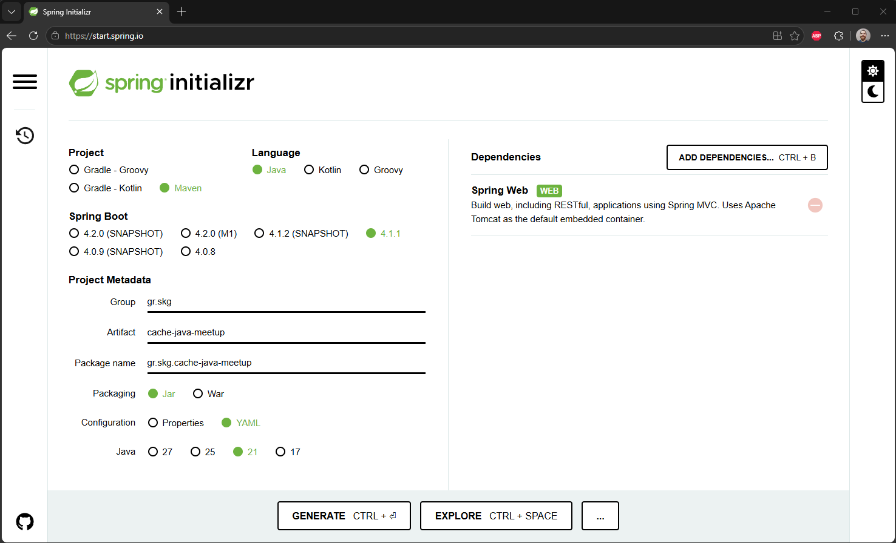

Click **GENERATE** (`CTRL+Enter`) to download the zip, extract it and open it in your IDE.

### The Domain: One Product, One Slow Repository

Create the following four classes in the base package `gr.skg.cachejavameetup`.

`Product.java` -- a record is all we need:

```java
package gr.skg.cachejavameetup;

record Product(Long id, String name, Double price) {}
```

`ProductRepository.java` -- simulates an expensive dependency (a database, a remote API, a heavy computation) by sleeping for one second on every call:

```java
package gr.skg.cachejavameetup;

import org.springframework.stereotype.Repository;

/**
 * A deliberately slow repository/service simulates an expensive dependency
 */
@Repository
class ProductRepository {

   public Product findById(Long id) {
      // simulate delay (1s)
      dbSlowOperation();

      return new Product(id, "iPhone", 1200.0);
   }

   private void dbSlowOperation() {
      try {
         Thread.sleep(1 * 1000);
      } catch (InterruptedException e) {
         throw new RuntimeException(e);
      }
   }
}
```

`ProductService.java` -- the class we will rewrite in almost every step. For now it just delegates:

```java
package gr.skg.cachejavameetup;

import org.springframework.stereotype.Service;

@Service
public class ProductService {
   private final ProductRepository productRepository;

   public ProductService(ProductRepository productRepository) {this.productRepository = productRepository;}

   public Product getProduct(Long id) {
      return productRepository.findById(id);
   }
}
```

`ProductController.java` -- exposes `GET /products/{id}`:

```java
package gr.skg.cachejavameetup;

import org.springframework.web.bind.annotation.GetMapping;
import org.springframework.web.bind.annotation.PathVariable;
import org.springframework.web.bind.annotation.RequestMapping;
import org.springframework.web.bind.annotation.RestController;

@RestController
@RequestMapping("/products")
class ProductController {
   private final ProductService productService;

   ProductController(ProductService productService) {this.productService = productService;}

   @GetMapping("/{id}")
   public Product findById(@PathVariable Long id) {
      return productService.getProduct(id);
   }
}
```

> [!NOTE]
> In this step the repository returns a product for **any** id. This is intentional: it lets us demonstrate an unbounded cache (Step 1) and size-based eviction (Step 2) by simply requesting many different ids. A realistic repository with 10 seeded products replaces it in Step 3.

### Run and Measure

Run the main class `App`. Once you see `Started App in … seconds`, request the same product three times:

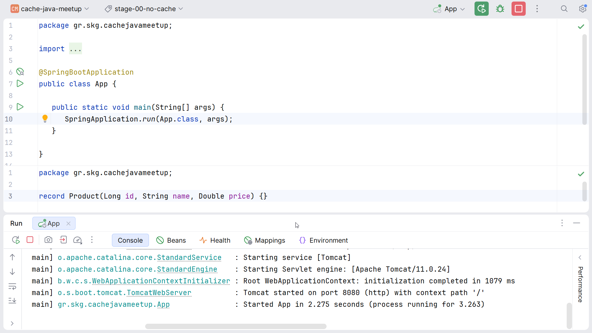

```bash
curl -w '\n%{time_total}s\n' localhost:8080/products/1
curl -w '\n%{time_total}s\n' localhost:8080/products/1
curl -w '\n%{time_total}s\n' localhost:8080/products/1
```

```text
{"id":1,"name":"iPhone","price":1200.0}
1.012s
{"id":1,"name":"iPhone","price":1200.0}
1.008s
{"id":1,"name":"iPhone","price":1200.0}
1.006s
```

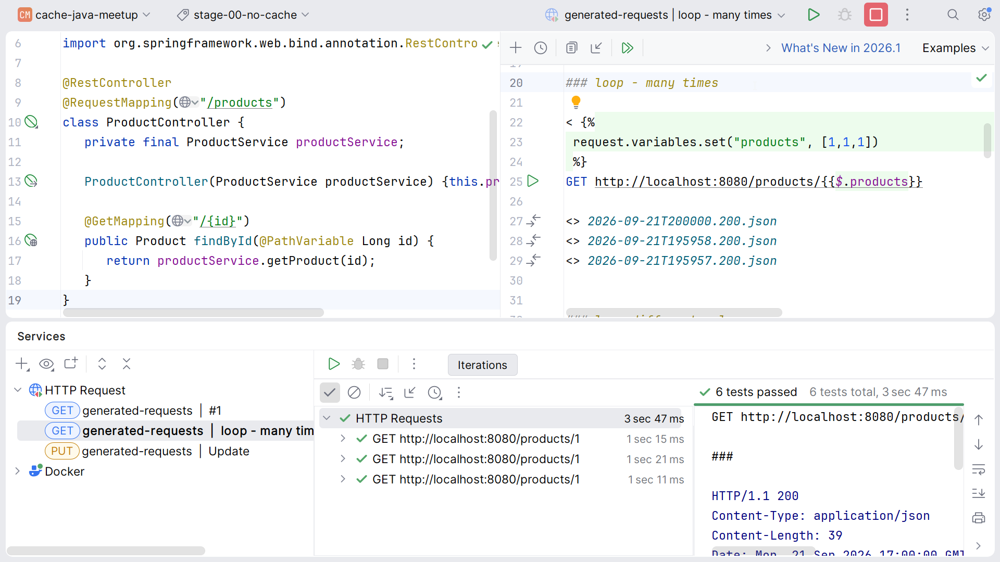

Every request takes ~1 second, and every request produces the same answer. This is the question for the rest of the workshop:

> If an operation takes one second and gives us the same answer 1,000 times, how many times should we really execute it?

### Where Can Caching Happen?

Before touching Java code, it is worth remembering that caching exists at every layer of a request:

```text
Browser  →  CDN  →  Reverse Proxy / Gateway  →  Application  →  Database
```

- **Browser**: `Cache-Control: max-age=3600`, `ETag`
- **CDN / Gateway**: static content, public API responses
- **Application** (this workshop): `ConcurrentHashMap`, Caffeine, Redis, Hazelcast, Ehcache …

The closer to the database, the more control -- and the more responsibility -- we have. We are going to move the cache progressively closer to the Java code and examine what changes.

### Initialize Git

```bash
cd cache-java-meetup
git init
git add .gitignore pom.xml src/
git commit -m "init commit. Get Product"
```

> [!NOTE]
> **Checkpoint.** This is tag `stage-00-no-cache` in the demo repository.

---

## Step 1: The Naive Cache -- HashMap and ConcurrentHashMap

The first thing everyone writes. It is intentionally satisfying -- and then we ask what is wrong with it.

### Just Use a Map

Replace the body of `ProductService` with a `HashMap` and the classic *get → null-check → load → put* shape:

```java
package gr.skg.cachejavameetup;

import org.springframework.stereotype.Service;

import java.util.HashMap;
import java.util.Map;

@Service
public class ProductService {
   private final ProductRepository productRepository;
   // Simple Cache
   private final Map<Long, Product> cache = new HashMap<>();

   public ProductService(ProductRepository productRepository) {this.productRepository = productRepository;}

   public Product getProduct(Long id) {
      Product cached = cache.get(id);
      if (cached != null) {
         return cached;
      }

      Product product = productRepository.findById(id);
      cache.put(id, product);
      return product;
   }
}
```

Restart and request product 1 twice:

```bash
curl -w '\n%{time_total}s\n' localhost:8080/products/1
curl -w '\n%{time_total}s\n' localhost:8080/products/1
```

```text
{"id":1,"name":"iPhone","price":1200.0}
1.009s
{"id":1,"name":"iPhone","price":1200.0}
0.004s
```

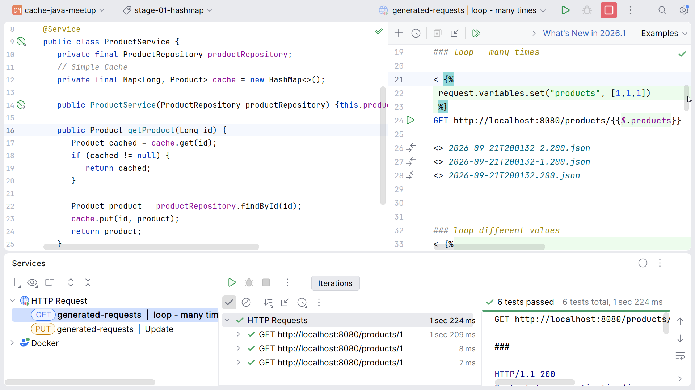

First call ~1 s, every call after that a few milliseconds. **So… are we done?**

### What Is Wrong With the HashMap Cache?

- `HashMap` is **not thread-safe** -- concurrent `put`s can corrupt it
- **No TTL, no maximum size, no eviction** -- memory grows forever
- No statistics, no loading coordination (two concurrent misses = two loads)
- No invalidation strategy
- No distributed behaviour -- every JVM has its own copy

The two that hurt in production are thread-safety and unbounded growth. The rest are the reasons a cache library exists.

Demonstrate the growth: because the repository still returns a product for *any* id, this loop keeps adding entries and nothing ever removes one:

```bash
for id in $(seq 1 100000); do curl -s localhost:8080/products/$id > /dev/null; done
```

Let it run for a few seconds, stop it, and say it out loud: *nothing in this class knows how to forget.*

> [!NOTE]
> **Checkpoint.** Tag `stage-01-hashmap`.

### A Slightly Better Naive Cache: ConcurrentHashMap

Two changes: `ConcurrentHashMap` instead of `HashMap`, and `computeIfAbsent` instead of the manual get/put dance:

```java
package gr.skg.cachejavameetup;

import org.springframework.stereotype.Service;

import java.util.Map;
import java.util.concurrent.ConcurrentHashMap;

@Service
public class ProductService {
   private final ProductRepository productRepository;
   // Simple Cache, but thread safe
   private final Map<Long, Product> cache = new ConcurrentHashMap<>();

   public ProductService(ProductRepository productRepository) {this.productRepository = productRepository;}

   public Product getProduct(Long id) {
      // Thread Safe operation, and more elegant
      return cache.computeIfAbsent(id, productRepository::findById);
   }
}
```

Compact, thread-safe, one line -- and `computeIfAbsent` even gives us **per-key loading coordination**: two concurrent requests for the same id result in one repository call, the second one waits.

Now ask the question that this step cannot answer:

> When does this value disappear from memory?

It does not -- unless we explicitly remove it. That is the bridge to **eviction** and **expiration**.

> [!NOTE]
> **Checkpoint.** Tag `stage-02-concurrenthashmap`.

---

## Step 2: A Real Local Cache -- Caffeine

[Caffeine](https://github.com/ben-manes/caffeine) is the de-facto in-memory cache for Java: a `ConcurrentHashMap` with policies around the data. In this step we add it in three small increments: basic usage, policies & statistics, and `LoadingCache` with background refresh.

### Add the Dependency

Spring Boot manages the Caffeine version, so no `<version>` is needed:

```xml
<dependency>
   <groupId>com.github.ben-manes.caffeine</groupId>
   <artifactId>caffeine</artifactId>
</dependency>
```

### Caffeine Instead of ConcurrentHashMap

The shape of the service does not change. The `Map` becomes a `Cache`, and `computeIfAbsent` becomes `cache.get(key, loader)`:

```java
package gr.skg.cachejavameetup;

import com.github.benmanes.caffeine.cache.Cache;
import com.github.benmanes.caffeine.cache.Caffeine;
import org.springframework.stereotype.Service;

import java.time.Duration;

@Service
public class ProductService {
   private final ProductRepository productRepository;
   // Local cache with Caffeine
   Cache<Long, Product> cache = Caffeine.newBuilder()
         .maximumSize(10)
         .expireAfterWrite(Duration.ofMinutes(1)) // keep for a fixed duration
         // .expireAfterAccess(Duration.ofMinutes(1)) // keep frequently accessed data
         .build();

   public ProductService(ProductRepository productRepository) {this.productRepository = productRepository;}

   public Product getProduct(Long id) {
      // Thread Safe operation, and more elegant
      return cache.get(id, productRepository::findById);
   }
}
```

Restart, run the two curls: same behaviour as before (1 s, then 0 ms) -- but now the cache has a **bound** (`maximumSize(10)`) and a **lifetime** (`expireAfterWrite(1m)`).

- `maximumSize` -- bounded memory; when exceeded, Caffeine evicts the entries least likely to be used again (its Window-TinyLFU policy)
- `expireAfterWrite` -- fixed lifetime from the moment the entry was written
- `expireAfterAccess` -- lifetime resets on every read; keeps *hot* entries alive

> [!TIP]
> A cache library is not just a `Map`. It is a `Map` **with policies around the data**.

> [!NOTE]
> **Checkpoint.** Tag `stage-03-caffeine`.

### Eviction Listener and Statistics

Two more builder calls make the cache observable: an `evictionListener` prints every entry that leaves, and `recordStats()` turns hit/miss/load/eviction counts on.

```java
// Local cache with Caffeine
Cache<Long, Product> cache = Caffeine.newBuilder()
      .maximumSize(10)
      .expireAfterWrite(Duration.ofMinutes(1)) // keep for a fixed duration
      // .expireAfterAccess(Duration.ofMinutes(1)) // keep frequently accessed data
      .evictionListener((key, value, cause) -> {
         System.out.println("Evicting product: " + key);
      })
      .recordStats()
      .build();
```

Two endpoints in `ProductController` expose the cache contents and the statistics (the `cache` field is package-private for exactly this reason -- fine for a demo, not for production):

```java
@GetMapping("/cache")
public Map<Long, Product> cacheContents() {
   return new HashMap<>(productService.cache.asMap());
}

@GetMapping("/cache/stats")
public String cacheStats() {
   return productService.cache.stats().toString();
}
```

Restart, request product 1 three times, then ask for the statistics:

```bash
curl localhost:8080/products/1
curl localhost:8080/products/1
curl localhost:8080/products/1
curl localhost:8080/products/cache/stats
```

```text
CacheStats{hitCount=2, missCount=1, loadSuccessCount=1, loadFailureCount=0, totalLoadTime=1010992200, evictionCount=0, evictionWeight=0}
```

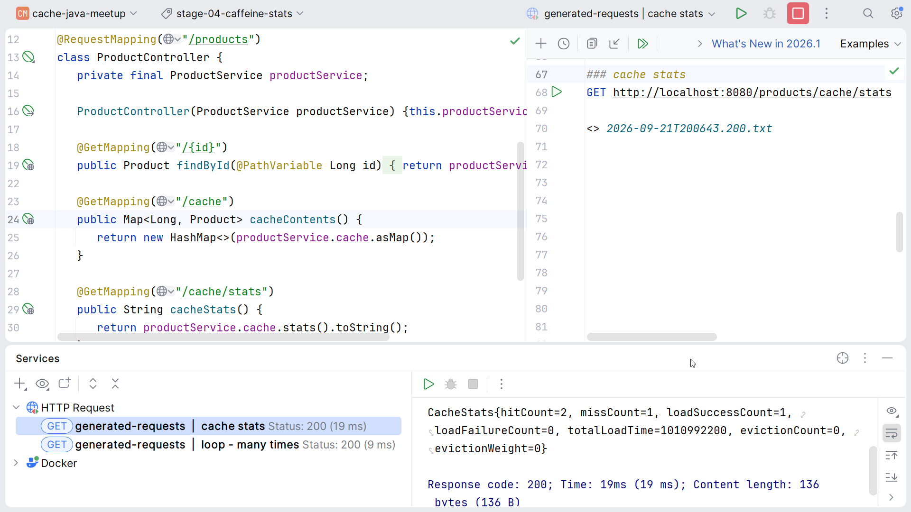

One miss, two hits, one load that took about a second (`totalLoadTime` is in nanoseconds). Now watch an entry *leave*. The simplest way is expiration: request product 1, wait a little more than a minute (`expireAfterWrite(1m)`), and request it again. The second request finds an expired entry, evicts it, reloads it -- and the listener prints:

```text
Evicting product: 1
```

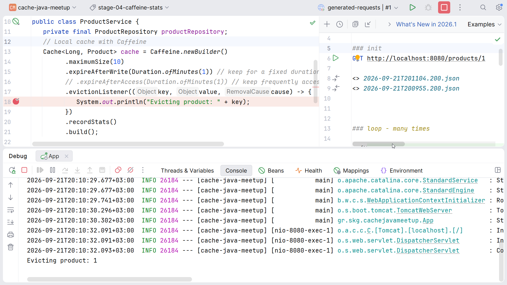

The other way is size: the repository still returns a product for any id, so requesting ids 1 to 11 exceeds `maximumSize(10)` and one of them is evicted.

```bash
for id in $(seq 1 11); do curl -s localhost:8080/products/$id > /dev/null; done
curl localhost:8080/products/cache
```

> [!WARNING]
> **Caffeine evicts lazily and asynchronously.** An entry that expired at 1:00 is removed (and the listener called) on the *next read or write*, not by a timer -- if you wait for the log line without making a request, it will not appear. Likewise the size-based `Evicting product: …` line may appear on a later request rather than exactly on the 11th, and which key gets evicted depends on the frequency sketch, not on insertion order.

`recordStats` is what turns a cache from a hope into something measurable: hit ratio, load count, evictions. In production these numbers go to Micrometer (`CaffeineCacheMetrics`), not to `System.out`.

> [!NOTE]
> **Checkpoint.** Tag `stage-04-caffeine-stats`.

### LoadingCache and refreshAfterWrite

So far the *call site* knows how to load a missing value (`cache.get(id, productRepository::findById)`). A `LoadingCache` moves the loader into the cache itself, and unlocks `refreshAfterWrite`:

```java
package gr.skg.cachejavameetup;

import com.github.benmanes.caffeine.cache.Caffeine;
import com.github.benmanes.caffeine.cache.LoadingCache;
import org.springframework.stereotype.Service;

import java.time.Duration;

@Service
public class ProductService {
   private final ProductRepository productRepository;
   // Loading cache with Caffeine
   final LoadingCache<Long, Product> cache;

   public ProductService(ProductRepository productRepository) {
      this.productRepository = productRepository;
      this.cache = Caffeine.newBuilder()
            .maximumSize(10)
            .refreshAfterWrite(Duration.ofSeconds(10)) // refresh is useful, to keep data "fresh"
            .expireAfterWrite(Duration.ofMinutes(1)) // keep for a fixed duration
            // .expireAfterAccess(Duration.ofMinutes(1)) // keep frequently accessed data
            .evictionListener((key, value, cause) -> {
               System.out.println("Evicting product: " + key);
            })
            .recordStats()
            .build(productRepository::findById);
   }

   public Product getProduct(Long id) {
      // The cache now knows how to obtain a missing value.
      return cache.get(id);
   }

}
```

The service method is now literally one line: `cache.get(id)`. The cache knows how to obtain a missing value.

The interesting part is the combination of the two time policies:

- `refreshAfterWrite(10s)` -- after 10 seconds, the **next read returns the old value immediately** and triggers an asynchronous reload in the background. The caller never waits.
- `expireAfterWrite(1m)` -- after 1 minute the entry is gone for real; the next read blocks on the loader.

Together they mean: hot keys stay fresh without ever blocking a request; cold keys simply expire. This is the difference between *"expire and block"* and *"keep serving while reloading"*.

> [!WARNING]
> `refreshAfterWrite` is **on-access**: nothing happens at the 10-second mark unless somebody reads the key. Try it: request product 1, wait 10+ seconds, request it again. The second request is still instant -- the reload happens in the background -- so if you want to *see* it, add a `System.out.println` inside `ProductRepository.findById`.

> [!NOTE]
> **Checkpoint.** Tag `stage-05-loadingcache`.

### Local Cache Topology -- What Happens on 10 Pods?

Everything so far lives in the JVM heap. That is also its limitation:

```text
Instance A              Instance B
---------               ---------
Caffeine                Caffeine
{1 -> Product}          {}
```

The same request reaching instance B is a **MISS**. With 10 pods we warm 10 caches, and we can serve 10 different prices for the same product. Sometimes that is fine; sometimes it is not. That is the motivation for a **shared** cache.

---

## Step 3: A Shared Cache -- Redis

[Redis](https://redis.io/) is an in-memory data store that runs as a separate process and is shared by all application instances. In this step we use it "by hand", with `RedisTemplate`, so that later the Spring Cache abstraction has something to hide.

### Shared Cache: Advantages and Costs

```text
      Redis
  /     |     \
App A  App B  App C
```

| Advantages                         | Costs                               |
|------------------------------------|-------------------------------------|
| Shared values across instances     | A network call on every read        |
| Survives application restarts      | Serialization / deserialization     |
| Centralised TTL                    | Infrastructure to run and monitor   |
| Bigger than one JVM heap           | Availability becomes your problem   |

> [!IMPORTANT]
> Redis is usually much faster than the database, but it is still a **network call plus a serialization step**. Caffeine is an in-process memory access. Keep both columns visible: the right column is why we do not default to Redis.

### Start Redis with Docker Compose

Create `compose.yaml` in the project root:

```yaml
services:
  redis:
    image: redis:7-alpine
    ports:
      - "6379:6379"
```

```bash
docker compose up -d
docker compose exec redis redis-cli ping     # PONG
```

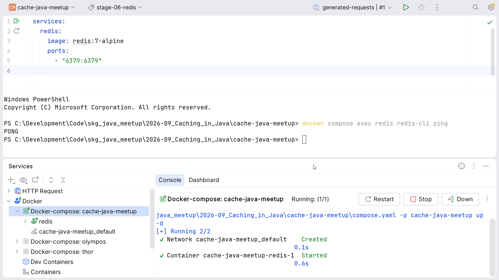

> [!TIP]
> IntelliJ's **Services** tool window shows the compose services with *Deploy / Restart / Stop / Down* actions (the run icon in the gutter of `compose.yaml` does the same as `docker compose up -d`). *Restart* keeps the container (and its data); *Down* deletes it. Spring Boot's Docker Compose support (`spring-boot-docker-compose`) could start Redis automatically, but we keep it explicit here so it is clear what is running.

### Add the Dependency

```xml
<dependency>
   <groupId>org.springframework.boot</groupId>
   <artifactId>spring-boot-starter-data-redis</artifactId>
</dependency>
```

No `application.yaml` changes are needed: Spring Boot defaults to `spring.data.redis.host=localhost` and `port=6379`.

### Redis Needs a Serializer

The first thing Redis forces on you is **serialization**. A `RedisTemplate` uses Java serialization for keys *and* values by default -- which fails for a record with `DefaultSerializer requires a Serializable payload`, and produces unreadable keys like `\xac\xed\x00\x05t\x00\tproduct:1` in `redis-cli`.

First make `Product` public so Jackson can see it:

```java
package gr.skg.cachejavameetup;

public record Product(Long id, String name, Double price) {}
```

Then create `RedisConfig.java` with a typed template: `String` keys, JSON values:

```java
package gr.skg.cachejavameetup;

import org.springframework.context.annotation.Bean;
import org.springframework.context.annotation.Configuration;
import org.springframework.data.redis.connection.RedisConnectionFactory;
import org.springframework.data.redis.core.RedisTemplate;
import org.springframework.data.redis.serializer.JacksonJsonRedisSerializer;
import org.springframework.data.redis.serializer.StringRedisSerializer;

/**
 * Redis Config.
 * By default, spring boot gives the properties
 * spring.data.redis.host=localhost & port=6379
 * so no extra yml config needed
 */
@Configuration
public class RedisConfig {
   @Bean
   RedisTemplate<String, Product> productRedisTemplate(RedisConnectionFactory connectionFactory) {
      // Note: this can be generic for Object, but then 'casting' and custom 'serializer'
      // are needed, to include the whole class in the key. For example:
      // {"@class":"gr.skg.cachejavameetup.Product","id":1,"name":"iPhone 16","price":1200.0}
      // vs {"id":1,"name":"iPhone 16","price":1200.0}
      RedisTemplate<String, Product> template = new RedisTemplate<>();
      template.setConnectionFactory(connectionFactory);
      template.setKeySerializer(new StringRedisSerializer());
      template.setValueSerializer(new JacksonJsonRedisSerializer<>(Product.class));
      return template;
   }
}
```

> [!NOTE]
> **Spring Boot 4 / Jackson 3.** The serializer class is `JacksonJsonRedisSerializer` (package `org.springframework.data.redis.serializer`). The `Jackson2JsonRedisSerializer` / `GenericJackson2JsonRedisSerializer` classes you will find in most blog posts are the Boot 3 / Jackson 2 variants and are deprecated in Spring Data Redis 4. The typed serializer is the simplest option; the generic one needs default typing (`@class` property) to deserialize back to your type, and in 4.x that is off unless you enable it explicitly through its builder.

### A Realistic Repository

From this step on, the repository is a real (if tiny) catalogue: 10 seeded products in a `ConcurrentHashMap`, and an exception for unknown ids. It still sleeps for one second.

```java
package gr.skg.cachejavameetup;

import org.springframework.stereotype.Repository;

import java.util.Map;
import java.util.concurrent.ConcurrentHashMap;

/**
 * A deliberately slow repository/service simulates an expensive dependency
 */
@Repository
class ProductRepository {

   private final Map<Long, Product> db = new ConcurrentHashMap<>();

   public ProductRepository() {
      db.put(1L, new Product(1L, "iPhone 16", 1200.0));
      db.put(2L, new Product(2L, "MacBook Air M3", 1350.0));
      db.put(3L, new Product(3L, "Mechanical Keyboard", 129.99));
      db.put(4L, new Product(4L, "Wireless Mouse", 49.90));
      db.put(5L, new Product(5L, "27\" 4K Monitor", 399.00));
      db.put(6L, new Product(6L, "USB-C Docking Station", 179.50));
      db.put(7L, new Product(7L, "Noise Cancelling Headphones", 299.00));
      db.put(8L, new Product(8L, "Webcam 1080p", 79.00));
      db.put(9L, new Product(9L, "Ergonomic Office Chair", 450.00));
      db.put(10L, new Product(10L, "Standing Desk", 620.00));
   }

   public Product findById(Long id) {
      // simulate delay (1s)
      dbSlowOperation();

      Product product = db.get(id);
      if (product == null) {
         throw new RuntimeException("Product Not Found: " + id);
      }
      return product;
   }

   private void dbSlowOperation() {
      try {
         Thread.sleep(1 * 1000);
      } catch (InterruptedException e) {
         throw new RuntimeException(e);
      }
   }
}
```

> [!WARNING]
> From here on, only ids **1 to 10** exist. The "unbounded growth" loop of Step 1 would return HTTP 500 from id 11 onwards, which is why that demo belongs to Steps 1-2.

### Redis, by Hand

The service goes back to the *get → null-check → load → put* shape of Step 1, but the map is now on the other side of a socket, and the `set` carries a TTL:

```java
package gr.skg.cachejavameetup;

import org.springframework.data.redis.core.RedisTemplate;
import org.springframework.stereotype.Service;

import java.time.Duration;
import java.util.Set;

@Service
public class ProductService {
   private final ProductRepository productRepository;
   // Shared Cache - Redis
   private final RedisTemplate<String, Product> redisTemplate;

   public ProductService(ProductRepository productRepository,
                         RedisTemplate<String, Product> redisTemplate) {
      this.productRepository = productRepository;
      this.redisTemplate = redisTemplate;
   }

   public Product getProduct(Long id) {
      String key = "product:" + id;

      Product cached = redisTemplate.opsForValue().get(key);
      if (cached != null) {
         return cached;
      }

      Product product = productRepository.findById(id);
      redisTemplate.opsForValue().set(key, product, Duration.ofMinutes(10));
      return product;
   }

   public Set<String> cacheKeys() {
      return redisTemplate.keys("product:*");
   }

}
```

And the controller's `/cache` endpoint now lists the Redis keys (the `/cache/stats` endpoint goes away -- Redis keeps server-wide statistics, see the cheat sheet below):

```java
@GetMapping("/cache")
public Set<String> cacheKeys() {
   return productService.cacheKeys();
}
```

### Test It

Open a second terminal with `MONITOR` running **before** the curls -- it is the most convincing visual of this step, a live stream of every command the application sends to Redis:

```bash
docker compose exec redis redis-cli MONITOR
```

Then, in the first terminal:

```bash
docker compose exec redis redis-cli FLUSHALL
curl -w '\n%{time_total}s\n' localhost:8080/products/1      # ~1 s
curl -w '\n%{time_total}s\n' localhost:8080/products/1      # ~0.00 s
```

The first request shows a `GET` (miss) followed by a `SET … PX 600000`; the second shows only a `GET`:

```text
"GET" "product:1"
"SET" "product:1" "{\"id\":1,\"name\":\"iPhone 16\",\"price\":1200.0}" "PX" "600000"
"GET" "product:1"
```

Inspect the value and its remaining lifetime:

```bash
docker compose exec redis redis-cli GET product:1
docker compose exec redis redis-cli TTL product:1
```

```text
"{\"id\":1,\"name\":\"iPhone 16\",\"price\":1200.0}"
(integer) 587
```

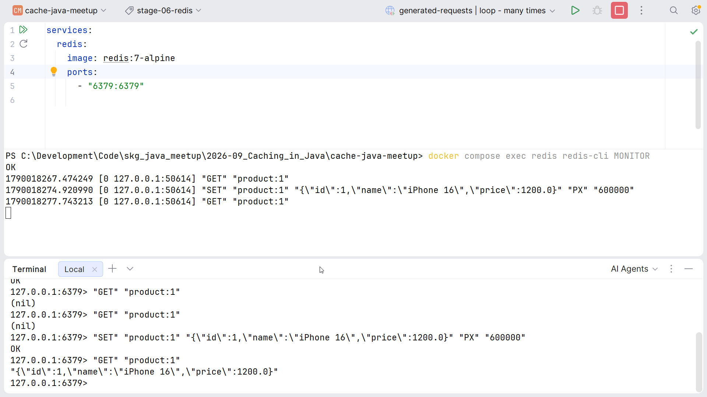

Now **restart the application** and request product 1 again: still a hit, ~0 ms. Caffeine would have lost everything; the cache now outlives the process.

> [!NOTE]
> **Checkpoint.** Tag `stage-06-redis`.

### Redis UIs

`redis-cli` is enough, but a UI makes keys, values and TTLs visible to the whole room. Extend `compose.yaml` with two of them:

```yaml
services:
  redis:
    image: redis:7-alpine
    ports:
      - "6379:6379"

  # A very lightweight UI (~50mb) for Redis
  # Open: http://localhost:8081/
  redis-commander:
    image: rediscommander/redis-commander:latest
    environment:
      REDIS_HOSTS: local:redis:6379
    ports:
      - "8081:8081"
    depends_on:
      - redis

  # The Official Redis Monitor UI.
  # Open: http://localhost:5540/
  # Set Connection URL: redis://default@redis:6379
  redisinsight:
    image: redis/redisinsight:latest
    ports:
      - "5540:5540"
    depends_on:
      - redis
```

```bash
docker compose up -d      # picks up the two new services
```

- **Redis Commander** ([localhost:8081](http://localhost:8081)): a tree of keys, values, TTL and a built-in CLI. The lightest option, zero onboarding.

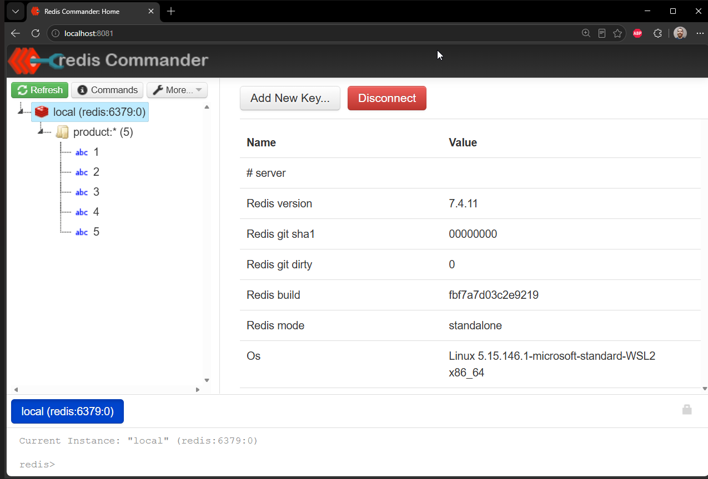

- **Redis Insight** ([localhost:5540](http://localhost:5540)): add a database with the connection URL `redis://default@redis:6379`. Richer: Browser, Workbench (CLI with autocomplete), Analyze (memory by key prefix, slow log) and Profiler (`MONITOR` with a UI).

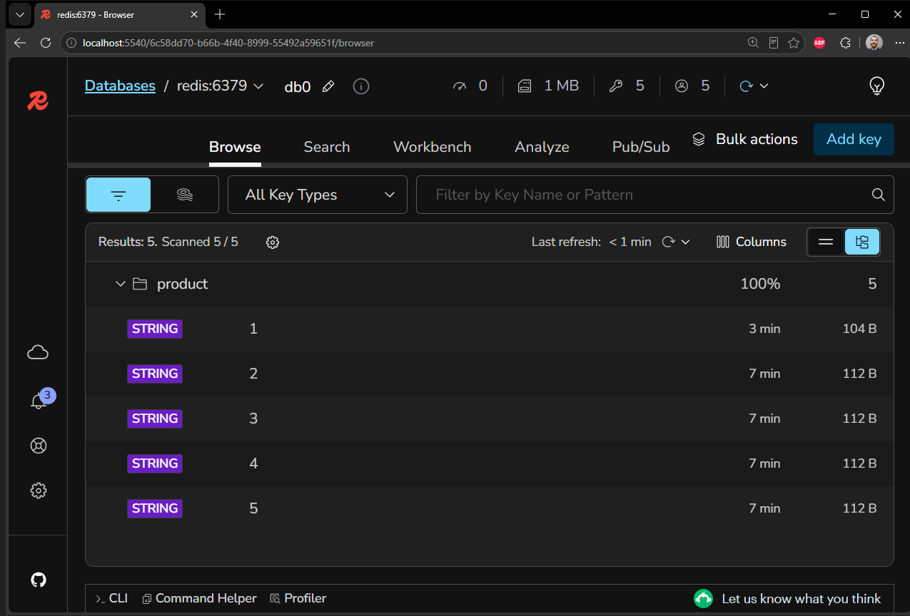

> [!TIP]
> Inside a container, `127.0.0.1` is the container itself. That is why the connection URL uses the compose service name `redis`, not `localhost`.

> [!NOTE]
> **Checkpoint.** Tag `stage-07-redis-ui`.

### Redis Operations Cheat Sheet

```bash
docker compose exec -it redis redis-cli      # interactive shell
```

```text
PING                        # PONG
DBSIZE                      # number of keys
KEYS product:*              # keys of this step
KEYS products::*            # keys of Spring Cache (Step 4)
GET product:1               # JSON value
TTL product:1               # seconds left, -1 = no expiry, -2 = missing
DEL product:1               # manual invalidation
FLUSHALL                    # clean start before a demo
MONITOR                     # live stream of commands (Ctrl+C to stop)
INFO stats                  # keyspace_hits / keyspace_misses (server-wide)
INFO memory                 # used_memory_human
CONFIG RESETSTAT            # reset the hit/miss counters (FLUSHALL does not)
```

> [!WARNING]
> `KEYS` is O(N) and blocks the server while it scans. Fine for 10 keys in a demo; use `SCAN` in production.

**Does a Redis restart clear the data?** No. The `redis:7-alpine` image runs with default RDB snapshotting, writes `dump.rdb` on a graceful shutdown, and the container keeps its filesystem -- so `docker compose restart` brings the keys back, TTLs included. Data is lost on `docker compose down` (container deleted). To make every restart start clean, disable persistence:

```yaml
redis:
  image: redis:7-alpine
  command: ["redis-server", "--save", "", "--appendonly", "no"]
```

For the workshop, `FLUSHALL` is the fastest clean start and does not interrupt the application's connection.

### Do We Really Want This Boilerplate?

Look at what we have written so far:

- `if cached … load … put` -- the same five lines, three times: `HashMap`, Caffeine, Redis
- Serialization details leaking into a service class
- A business method that is now *mostly* caching

This is exactly the problem the Spring Cache abstraction solves.

---

## Step 4: The Spring Cache Abstraction -- @Cacheable and Three Providers

Spring's cache abstraction moves the caching code out of the business method and into an annotation, and moves the *where do values live* decision into configuration. In this step the Java method stays identical while we switch the provider three times: `ConcurrentMap` → Caffeine → Redis.

### @Cacheable Is Not a Cache

The single most important idea of this step:

```text
@Cacheable
     ↓
Spring Cache abstraction
     ↓
CacheManager
     ↓
Actual cache implementation (ConcurrentMap / Caffeine / Redis / JCache …)
```

`@Cacheable` **describes** caching behaviour. The `CacheManager` **decides** where the values actually live. Everything we built by hand in Steps 1-3 becomes a *provider* behind that line.

### Add the Dependency

```xml
<dependency>
   <groupId>org.springframework.boot</groupId>
   <artifactId>spring-boot-starter-cache</artifactId>
</dependency>
```

> [!IMPORTANT]
> **Spring Boot 4 needs this starter.** The cache auto-configuration lives in the `spring-boot-cache` module, which only this starter brings in. Without it, `@EnableCaching` compiles, the application starts, and no `CacheManager` is created -- the annotation is silently ignored.

### Enable Caching and Prove Which Provider Is Active

`@EnableCaching` on the application class turns the annotations on. The `ApplicationRunner` is not required -- it only prints the active `CacheManager` and the native cache class at startup, so nobody has to take our word for which provider is in use:

```java
package gr.skg.cachejavameetup;

import org.springframework.boot.ApplicationRunner;
import org.springframework.boot.SpringApplication;
import org.springframework.boot.autoconfigure.SpringBootApplication;
import org.springframework.cache.CacheManager;
import org.springframework.cache.annotation.EnableCaching;
import org.springframework.context.annotation.Bean;

@EnableCaching
@SpringBootApplication
public class App {

   public static void main(String[] args) {
      SpringApplication.run(App.class, args);
   }

   // Not required. It's just to log the CacheManager implementation
   @Bean
   ApplicationRunner logCacheManager(CacheManager cacheManager) {
      return args -> {
         var cache = cacheManager.getCache("products");
         System.out.println("CacheManager: " + cacheManager.getClass().getSimpleName());
         System.out.println("Native cache: " + cache.getNativeCache().getClass().getName());
      };
   }

}
```

### The Reveal: The Service Is One Line Again

Delete `RedisConfig.java` and the `/cache` endpoint in the controller. The service becomes:

```java
package gr.skg.cachejavameetup;

import org.springframework.cache.annotation.Cacheable;
import org.springframework.stereotype.Service;

@Service
public class ProductService {
   private final ProductRepository productRepository;

   public ProductService(ProductRepository productRepository) {
      this.productRepository = productRepository;
   }

   @Cacheable("products")
   public Product getProduct(Long id) {
      return productRepository.findById(id);
   }

}
```

### What Happens Behind @Cacheable

Nothing magic. Conceptually, Spring generates the `HashMap` code of Step 1 around your method:

```java
public Product getProduct(Long id) {
    Product cached = cache.get(id);
    if (cached != null) {
        return cached;
    }
    Product result = repository.findById(id);
    cache.put(id, result);
    return result;
}
```

It does this through a **proxy** around the bean. The method body executes **only on a cache miss**. The cache name is `products`; the key is, by default, the method arguments -- with a single argument, the key is that argument (`1`).

### Provider 1: simple (ConcurrentMapCacheManager)

```yaml
spring:
  application:
    name: cache-java-meetup
  cache:
    type: simple
```

Restart. The startup log shows the provider:

```text
CacheManager: ConcurrentMapCacheManager
Native cache: java.util.concurrent.ConcurrentHashMap
```

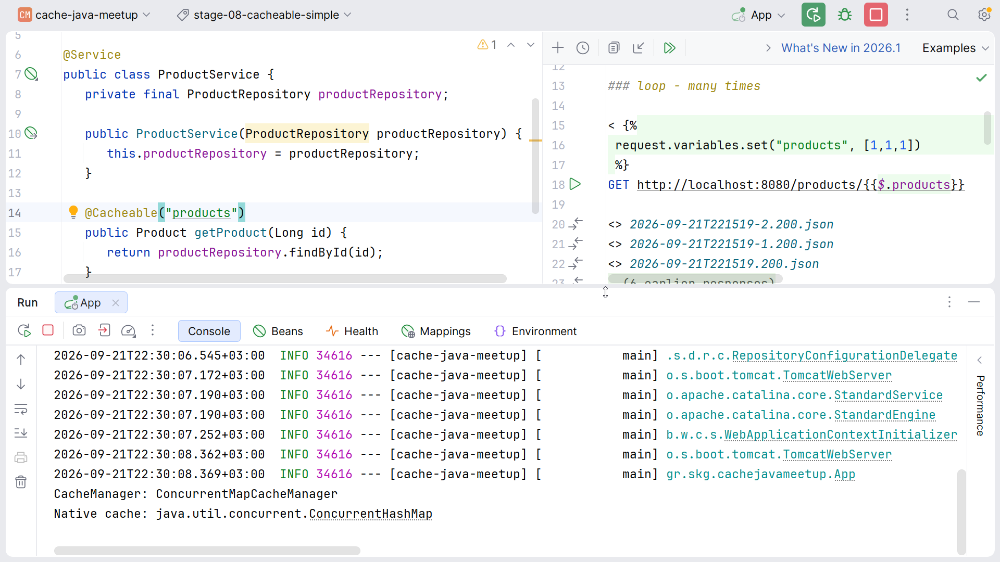

Run the two curls: 1 s, then 0 ms. We are back to Step 1 -- a `ConcurrentHashMap`, no TTL, no bound -- but the service method knows nothing about it.

> [!NOTE]
> **Checkpoint.** Tag `stage-08-cacheable-simple`.

### Provider 2: Caffeine (CaffeineCacheManager)

Only `application.yaml` changes. The `spec` string is Caffeine's own `CaffeineSpec` format -- the same policies we used in Step 2:

```yaml
spring:
  application:
    name: cache-java-meetup
  cache:
    type: caffeine
    caffeine:
      spec: maximumSize=10,expireAfterWrite=1m,recordStats
```

```text
CacheManager: CaffeineCacheManager
Native cache: com.github.benmanes.caffeine.cache.BoundedLocalCache$BoundedLocalManualCache
```

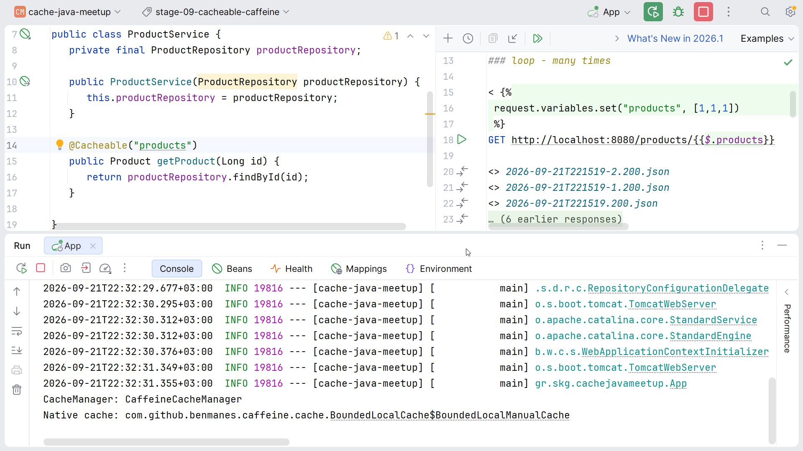

```text
@Cacheable  →  CaffeineCacheManager  →  Caffeine  →  JVM memory
```

**Not one line of Java changed.**

> [!NOTE]
> **Checkpoint.** Tag `stage-09-cacheable-caffeine`.

### Provider 3: Redis (RedisCacheManager)

Switch the YAML once more:

```yaml
spring:
  application:
    name: cache-java-meetup
  cache:
    type: redis
    redis:
      time-to-live: 1m
```

This time a small configuration class is needed too, because `RedisCacheManager` defaults to JDK serialization (binary values, and a `Serializable` requirement our record does not meet). `CacheConfig.java`:

```java
package gr.skg.cachejavameetup;

import org.springframework.boot.cache.autoconfigure.CacheProperties;
import org.springframework.context.annotation.Bean;
import org.springframework.context.annotation.Configuration;
import org.springframework.data.redis.cache.RedisCacheConfiguration;
import org.springframework.data.redis.serializer.JacksonJsonRedisSerializer;
import org.springframework.data.redis.serializer.RedisSerializationContext;

import java.time.Duration;

@Configuration
public class CacheConfig {

   // This is needed, as otherwise the default Serializable will store values
   // as binary instead of json. Sometimes binary is preferred (for performance)
   @Bean
   RedisCacheConfiguration redisCacheConfiguration(CacheProperties cacheProperties) {
      return RedisCacheConfiguration.defaultCacheConfig()
            .entryTtl(cacheProperties.getRedis().getTimeToLive()) // inject property, otherwise -1!
            .serializeValuesWith(RedisSerializationContext.SerializationPair
                  .fromSerializer(new JacksonJsonRedisSerializer<>(Product.class)));
   }

}
```

```text
CacheManager: RedisCacheManager
Native cache: org.springframework.data.redis.cache.DefaultRedisCacheWriter
```

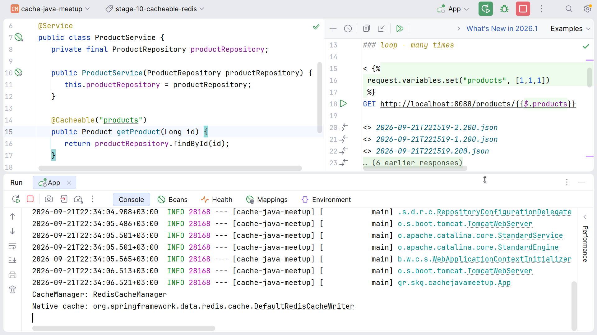

```bash
docker compose exec redis redis-cli FLUSHALL
curl localhost:8080/products/1
curl localhost:8080/products/1
docker compose exec redis redis-cli KEYS 'products::*'
docker compose exec redis redis-cli GET products::1
docker compose exec redis redis-cli TTL products::1
```

```text
1) "products::1"
"{\"id\":1,\"name\":\"iPhone 16\",\"price\":1200.0}"
(integer) 54
```

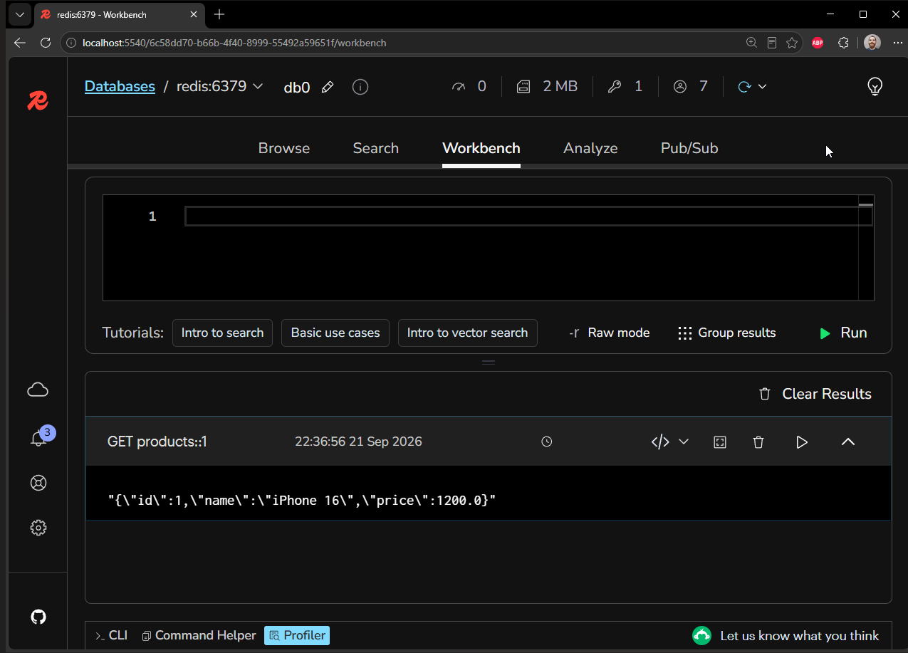

Note the key format: `RedisCacheManager` uses `<cacheName>::<key>` → `products::1`, whereas our manual template used `product:1`. And the TTL is now 1 minute (from YAML) instead of the 10 minutes hard-coded in Step 3.

> [!NOTE]
> **Checkpoint.** Tag `stage-10-cacheable-redis`.

### Same Annotation, Three Providers

| `application.yaml`                                                       | Startup log                             | Values live in     |
|--------------------------------------------------------------------------|-----------------------------------------|--------------------|
| `spring.cache.type: simple`                                              | `CacheManager: ConcurrentMapCacheManager` | JVM heap, unbounded |
| `spring.cache.type: caffeine` + `spec: maximumSize=10,expireAfterWrite=1m,recordStats` | `CacheManager: CaffeineCacheManager`    | JVM heap, bounded  |
| `spring.cache.type: redis` + `time-to-live: 1m`                          | `CacheManager: RedisCacheManager`       | Remote shared cache |

```text
Local                          Distributed
-----                          -----------
@Cacheable                     @Cacheable
   ↓                              ↓
Caffeine                       Redis
   ↓                              ↓
JVM memory                     Remote shared cache
```

The Java method is identical while the operational characteristics change completely.

### Spring Boot 4 Gotchas

Each of these cost real debugging time while building the demo. All were verified against the Spring Boot 4.1.1 / Spring Data Redis 4.1.1 artifacts.

> [!IMPORTANT]
> 1. **`spring-boot-starter-cache` is required.** `@EnableCaching` alone gives you no `CacheManager` (see above).
> 2. **Set `spring.cache.type` explicitly.** The auto-detection order is Generic, JCache, Hazelcast, Infinispan, Couchbase, **Redis**, Cache2k, **Caffeine**, Simple. With both Redis and Caffeine on the classpath, an unset type silently picks Redis.
> 3. **`RedisCacheManager` defaults to `JdkSerializationRedisSerializer`.** A record that is not `Serializable` fails at the first `put`. Either `implements Serializable` (binary values in Redis) or declare a `RedisCacheConfiguration` bean with a JSON serializer, as `CacheConfig` does.
> 4. **A `RedisCacheConfiguration` bean disables the `spring.cache.redis.*` properties.** Boot uses your bean as-is, so `time-to-live`, `key-prefix` and `cache-null-values` from YAML are ignored. `CacheConfig` injects `CacheProperties` and calls `entryTtl(cacheProperties.getRedis().getTimeToLive())` to keep YAML as the source of truth. Without that line, `TTL products::1` returns `-1` (never expires).
> 5. **Jackson 3.** Packages are `tools.jackson.*`, not `com.fasterxml.jackson.*`; the serializers are `JacksonJsonRedisSerializer` and `GenericJacksonJsonRedisSerializer`.

### Cache Keys

The default key is the method arguments. With one argument the key is that argument; with several, Spring builds a `SimpleKey` from all of them. For anything non-trivial, be explicit with SpEL:

```java
@Cacheable(cacheNames = "products", key = "#id")
public Product getProduct(Long id) { ... }

@Cacheable(cacheNames = "search", key = "#category + ':' + #page")
public List<Product> search(String category, int page) { ... }
```

> [!WARNING]
> **Bad cache keys silently return logically incorrect results.** A wrong key is the worst cache bug because nothing fails -- the response is just wrong. If two different calls can produce the same key, they will share a cached value.

### Optional: Seeing Every Hit and Miss

Two ways to watch the abstraction work, neither of which is committed in the demo:

`TRACE` logging on the cache interceptor:

```yaml
logging:
  level:
    org.springframework.cache: trace
```

```text
Computed cache key '1' for operation Builder[public gr.skg.cachejavameetup.Product gr.skg.cachejavameetup.ProductService.getProduct(java.lang.Long)] caches=[products] ...
No cache entry for key '1' in cache(s) [products]
Cache entry for key '1' found in cache(s) [products]
```

Or `spring-boot-starter-actuator` with `management.endpoints.web.exposure.include: health,caches`, and `GET /actuator/caches` lists every cache and its native class.

---

## Step 5: Invalidation -- The Stale-Data Bug, @CacheEvict and @CachePut

Storing a value is the easy part. This step adds an *update* operation and shows the bug that every cache eventually produces, then fixes it in two different ways. Keep the Redis provider from Step 4 so the stale value is visible in the UI.

### An Update Endpoint Without Cache Annotations

`ProductController` gets a `PUT`:

```java
@PutMapping("/{id}")
public Product update(@PathVariable Long id,
                      @RequestParam Double newPrice) {
   return productService.update(id, newPrice);
}
```

`ProductService` delegates:

```java
public Product update(Long id, Double newPrice) {
   return productRepository.update(id, newPrice);
}
```

`ProductRepository` updates the price atomically (and goes through the 1-second `findById` first, for the delay and the not-found check):

```java
public Product update(Long id, Double newPrice) {
   Product product = findById(id); // not needed, but just for the 'delay' and 'not found'

   // simulating atomic DB operation
   return db.computeIfPresent(id,
         (key, existing)
               -> new Product(existing.id(), existing.name(), newPrice));
}
```

### The Bug

```bash
docker compose exec redis redis-cli FLUSHALL
curl localhost:8080/products/1                              # price 1200.0
curl -X PUT "localhost:8080/products/1?newPrice=999"        # returns price 999.0
curl localhost:8080/products/1                              # STILL 1200.0
```

```text
{"id":1,"name":"iPhone 16","price":1200.0}
{"id":1,"name":"iPhone 16","price":999.0}
{"id":1,"name":"iPhone 16","price":1200.0}      ← stale
```

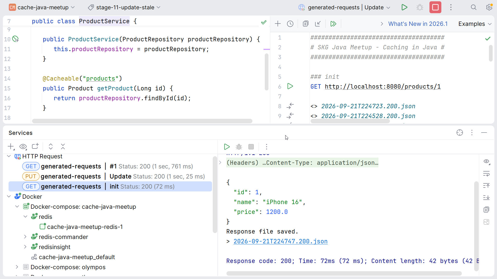

```text
Database = 999.0
Cache    = 1200.0
```

The database has the new price; the cache has the old one; the API returns the old one for up to a minute. This is the demo the audience remembers.

> [!IMPORTANT]
> **Cache invalidation is often harder than populating the cache.** The annotation on `getProduct` cannot know that `update` changed the data. Somebody has to tell the cache.

> [!NOTE]
> **Checkpoint.** Tag `stage-11-update-stale`.

### Fix 1: @CacheEvict

One annotation on `ProductService.update` removes the entry when the write happens. The key expression `#id` refers to the method argument and resolves to the same key `1` that `@Cacheable` used:

```java
package gr.skg.cachejavameetup;

import org.springframework.cache.annotation.CacheEvict;
import org.springframework.cache.annotation.Cacheable;
import org.springframework.stereotype.Service;

@Service
public class ProductService {
   private final ProductRepository productRepository;

   public ProductService(ProductRepository productRepository) {
      this.productRepository = productRepository;
   }

   @Cacheable("products")
   public Product getProduct(Long id) {
      return productRepository.findById(id);
   }

   @CacheEvict(cacheNames = "products", key = "#id")
   public Product update(Long id, Double newPrice) {
      return productRepository.update(id, newPrice);
   }
}
```

```bash
curl localhost:8080/products/1                              # 1200.0
curl -X PUT "localhost:8080/products/1?newPrice=999"        # 999.0, entry removed
curl -w '\n%{time_total}s\n' localhost:8080/products/1      # 999.0 after ~1 s (miss + reload)
```

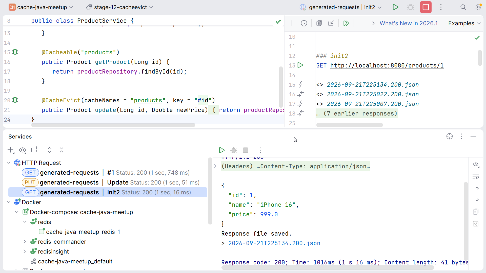

In Redis Insight the key `products::1` disappears after the `PUT` and reappears after the `GET`. Correct -- but the first read after every update pays the full price.

> [!NOTE]
> **Checkpoint.** Tag `stage-12-cacheevict`.

### Fix 2: @CachePut

`@CachePut` always runs the method and stores its result. The key expression `#result.id` shows that it can address the cache with the *returned* object rather than the argument:

```java
@CachePut(cacheNames = "products", key = "#result.id")
public Product update(Long id, Double newPrice) {
   return productRepository.update(id, newPrice);
}
```

```bash
curl localhost:8080/products/1                              # 1200.0
curl -X PUT "localhost:8080/products/1?newPrice=999"        # 999.0, entry replaced
curl -w '\n%{time_total}s\n' localhost:8080/products/1      # 999.0 in ~0 ms (hit)
```

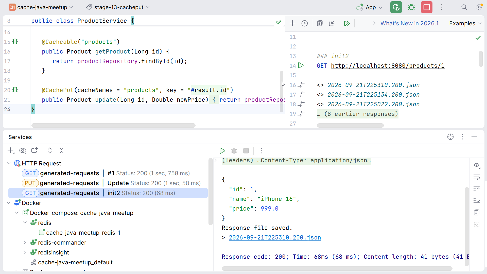

Run the same three-call sequence on the three tags and narrate the third call: **stale**, then **slow-but-correct**, then **fast-and-correct**.

> [!NOTE]
> **Checkpoint.** Tag `stage-13-cacheput` -- the final state of the repository.

### The Three Annotations

```text
@Cacheable  → may skip method execution on a hit
@CachePut   → always executes the method and stores the result
@CacheEvict → removes the entry (or the whole cache with allEntries = true)
```

The annotations work on any Spring bean's public method called through the proxy -- the demo puts them on the service, but a repository-level placement next to the write is equally valid. Keep `cacheNames` and `key` consistent with the matching `@Cacheable`.

### The Self-Invocation Trap

The first thing to check when "the cache does not work":

```java
@Service
public class ProductService {

    public Product load(Long id) {
        return getProduct(id);      // this.getProduct(): bypasses the proxy
    }

    @Cacheable("products")
    public Product getProduct(Long id) {
        return repository.findById(id);
    }
}
```

`load()` calls `this.getProduct()` directly. The cache advice lives on the **proxy**, and a call inside the same object never reaches the proxy, so the annotation is silently ignored. Same rule as `@Transactional`. Annotations are not magic.

---

## Step 6: Beyond the Demo -- Failure Modes and a Decision Framework

No code in this step. These are the things that decide whether a cache helps or hurts in production.

### Failure Modes

**Stale data**

```text
12:00 Cache stores price = 1200
12:01 Database changes price = 999
12:02 User reads cache = 1200
```

How stale are we willing to be? That answer -- a business answer, not a technical one -- determines the TTL and the invalidation strategy.

**Cache stampede / thundering herd.** A popular key expires; 1,000 concurrent requests miss; 1,000 database calls. Mitigations: coordinated loading (Caffeine's `get(key, loader)` does this per key inside one JVM), single-flight locks across instances, jittered TTLs, `refreshAfterWrite`, stale-while-revalidate.

**Unbounded cache.**

```java
Map<String, Object> cache = new ConcurrentHashMap<>();
```

If every request creates a new key: 10k → 100k → 1M entries → `OutOfMemoryError`. The strongest argument for a real cache library.

**Local cache inconsistency.**

```text
Instance A cache: price = 1200
Instance B cache: price = 999
Database:         price = 999
```

Two users see two prices. Sometimes perfectly acceptable, sometimes not. **Consistency is a business requirement, not automatically a technical one.**

### Caffeine vs Redis

| | Caffeine | Redis |
|---|---|---|
| Location | JVM memory | Remote process |
| Latency | Nanoseconds-microseconds | Network round trip |
| Shared between instances | No | Yes |
| Survives app restart | No | Yes (and a Redis restart too, with RDB) |
| Serialization | No | Yes (JSON here, JDK by default) |
| Operational complexity | Low | Higher |
| Memory | App heap | Redis memory |
| Best for | Local hot data | Shared / distributed cache |

> [!TIP]
> **Redis is not automatically "better" because it is distributed.** If local inconsistency is acceptable for your data, Caffeine is dramatically simpler and cheaper.

**L1 + L2.** The two are often combined:

```text
Request → L1: Caffeine → miss → L2: Redis → miss → Database
```

Every extra cache level makes reads faster and invalidation harder. Redis Pub/Sub is the usual channel to invalidate L1 across instances.

**Event-driven invalidation.** In larger systems the cache stops *guessing* when data changed: a Change Data Capture tool such as [Debezium](https://debezium.io/) streams every database commit as an event, and a small consumer evicts or refreshes the matching Redis key. Invalidation is then driven by the database itself, rather than by TTLs or by remembering to annotate every write path.

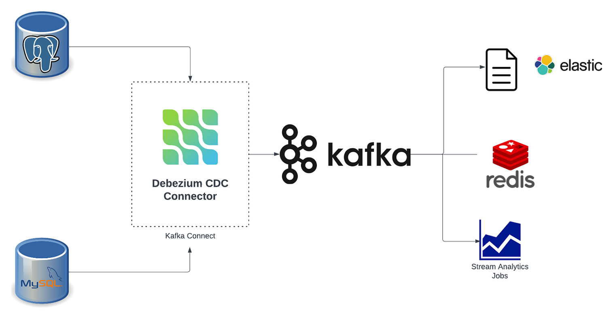

### Should We Cache This?

1. Is the operation actually expensive?
2. Is the same data requested repeatedly?
3. How frequently does the data change?
4. How stale may the result be?
5. What is the acceptable failure mode?
6. How many application instances are there?
7. Is cache invalidation practical?

**Do not cache by reflex. Measure first.**

### Which Cache?

```text
Is the operation expensive and repeated?
             |
            yes
             |
Can cached data be local to one app instance?
          /       \
        yes        no
        |           |
    Caffeine      Redis
        |           |
        +-----+-----+
              |
Want declarative Spring integration?
              |
         Spring Cache
         @Cacheable
```

A heuristic, not a law. Whichever provider you choose, the Spring abstraction lets you change your mind in YAML.

**What TTL should I use?** It depends on the business freshness requirement: a country list → hours or days; a product catalogue → minutes; stock availability → seconds, or no cache at all.

---

## Wrap-up

In this workshop we took one slow endpoint through every caching strategy a Java application is likely to use:

| Step | What We Built | Key Concept |
|------|--------------|-------------|
| **0** | A deliberately slow repository | The problem: 1 s per request, same answer every time |
| **1** | `HashMap` → `ConcurrentHashMap` | Thread-safety, `computeIfAbsent`, unbounded growth |
| **2** | Caffeine | `maximumSize`, `expireAfterWrite`, stats, `LoadingCache`, `refreshAfterWrite` |
| **3** | Redis by hand | Shared cache, serialization, TTL, `redis-cli`, Redis UIs |
| **4** | Spring Cache | `@Cacheable`, `CacheManager`, simple / Caffeine / Redis in YAML |
| **5** | Invalidation | Stale data, `@CacheEvict`, `@CachePut`, self-invocation |
| **6** | Beyond the demo | Failure modes, Caffeine vs Redis, decision framework |

### Key Takeaways

1. **A cache is not just a Map.** Production caches need policies: memory, expiration, eviction, concurrency, observability.
2. **Local and distributed caches solve different problems.** Caffeine = fastest + local. Redis = shared + distributed.
3. **`@Cacheable` is an abstraction.** It moves the caching code out of the business method and into configuration. It does not remove invalidation, staleness, TTL decisions, consistency or stampedes.

> The easiest part of caching is storing the value. The engineering challenge is deciding when that value stops being correct.

> [!NOTE]
> **Source Code.** [LefterisXris/java-caching-meetup-demo](https://github.com/LefterisXris/java-caching-meetup-demo) -- 14 commits, one per stage, tagged `stage-00-no-cache` … `stage-13-cacheput`. Start Redis with `docker compose up -d`; Redis Commander on `:8081`, Redis Insight on `:5540`.

### Resources

- [Spring Framework -- Cache Abstraction](https://docs.spring.io/spring-framework/reference/integration/cache.html)
- [Spring Boot -- Caching](https://docs.spring.io/spring-boot/reference/io/caching.html)
- [Caffeine -- GitHub & wiki](https://github.com/ben-manes/caffeine)
- [Caffeine -- Design of a Modern Cache (Ben Manes)](https://highscalability.com/design-of-a-modern-cache/)
- [Spring Data Redis -- Reference](https://docs.spring.io/spring-data/redis/reference/)
- [Redis -- Commands reference](https://redis.io/docs/latest/commands/)
- [Redis Insight](https://redis.io/insight/)
- [Debezium](https://debezium.io/)
- [Baeldung -- Spring Cache Guide](https://www.baeldung.com/spring-cache-tutorial)
- [Baeldung -- Caffeine](https://www.baeldung.com/java-caching-caffeine)
- [Baeldung -- Spring Boot Redis Cache](https://www.baeldung.com/spring-boot-redis-cache)
